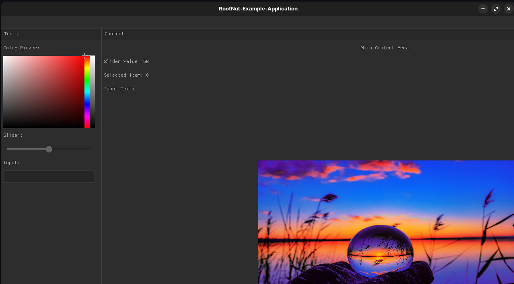

# RoofNut

**Version 1.24**

RoofNut is a lightweight GUI framework inspired by Walnut, using GLFW and Vulkan or OPENGL for rendering, and Nuklear for the GUI. It's an evolving library designed for high performance with a customizable, immediate-mode interface.

# Features:
Built on GLFW and Vulkan for efficient rendering.
Uses Nuklear for immediate-mode GUI.
OpenGL support. (1.12)
Uses stb_image to load images. (Only OpenGL version, vulkan version still in development)

# Getting Started:

**1. Install dependencies:**
Run this command to install required libraries automatically: 

***-NOTE-***
The only command that has been proven to work from testing is the *Debian* command. **The commands for the other distros might not work as expected.**

For Debian-based systems: * sudo apt-get install libx11-dev libxrandr-dev libxinerama-dev libxcursor-dev libxi-dev libxkbcommon-dev libwayland-dev *

For Fedora-based systems (DNF): * sudo dnf install libX11-devel libXrandr-devel libXinerama-devel libXcursor-devel glfw-devel vulkan-loader-devel libXi-devel * 

For Arch-based systems: * sudo pacman -S libx11 libxrandr libxinerama libxcursor glfw-x11 vulkan-loader libxi *

**2. Compile and build your application using RoofNut.**
Build your application using *./install.sh*, include *<roofnut.h>* and you are all set.

Alternative way, If your project has a cmake list you can use the command: add_subdirectory({*path-to-roofnut*}/RoofNut/install/CMakeLists.txt)

Compile command: g++ *path-to-your-file* -o *-your-executables-name-* -lRoofNut  -lGLEW -lGL 

g++ docs/examples/example.c -
o main -lRoofNut -lGL -lvulkan

Please see the *docs* folder for further explanation and examples

# Examples:
How many lines of code do you think this application took? I made this application with around 180 lines of code.

# Current Issues:

**1. Image rendering (vulkan)**, Images is not supported in the vulkan version". (Abandoned, *as of lack of driver support*)

**2. Alot of bugs (OpenGL)** , there is alot of bugs that i havent noticed yet, would need someone to test it. (Worked on.)

**3. Additonal debugging needed (vulkan)** , (Wickslynx) can't test the vulkan version as my drivers are outdated. Hence why i added OpenGL support. (Worked on)

**4. Built in GLEW support (OpenGL)** , i can't get the compiler to reqonise the built in GLEW library.. Abandoned as of now...

# Support:
Please email me on Wickslynx@yahoo.com
I will respond as soon as possible, updates come regularly. On School days almost every day.

***RoofNut is still in development!***
